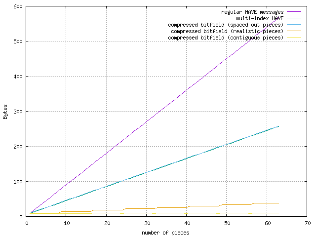
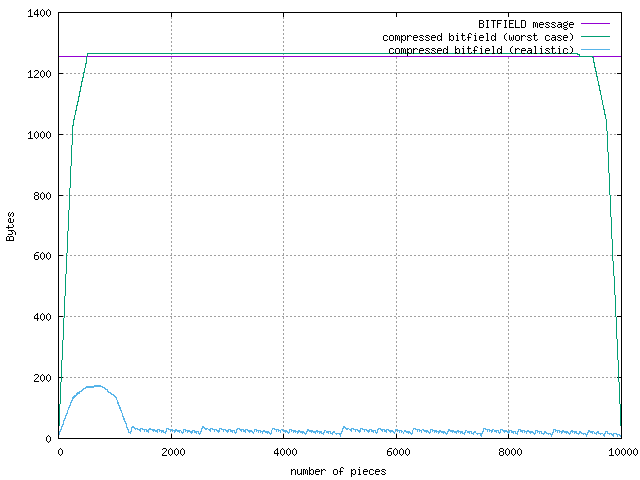

:BEP: 46
:Title: Have message for multiple pieces
:Version: $Revision$
:Last-Modified: $Date$
:Author:  Arvid Norberg <arvid@libtorrent.org>
:Status:  Draft
:Type:    Standards Track
:Content-Type: text/x-rst
:Created: 26-May-2016
:Post-History: 

Abstract
========

This BEP proposes an extension that aims to significantly reduce the overhead
of torrents with many pieces, by making representations more compact and
enabling coalescing of HAVE messages.

Rationale
=========

Small pieces have significant benefits. They enable:

1. Shorter delays from downloading data until it can be
   reliably consumed (important for streaming)
2. Shorter delays forwarding downloaded bytes to other peers. This is most
   obvious when first joining a swarm, but also significant in swarms
   bottlenecked by its seeds

Pieces should be small, ideally 16 kiB. The costs associated with small pieces
are:

1. the size of the .torrent file. Each piece hash is 20 bytes. a 4GiB torrent
   with 16 kiB pieces would have a .torrent file greater than 5 MB.
2. The size of bitfield messages. Every peer that has some but not all pieces
   send a bitfield during peer handshake. With this hypothetical 4 GiB torrent,
   each bitfield message would be 32 kiB (equivalent to two payload blocks).
3. The number of HAVE messages that would need to be sent to peers during
   downloads would be a lot higher. Each HAVE message is 9 bytes (length prefix,
   type and piece index) and possibly another 20 bytes if sent on an otherwise
   idle connection (TCP/IP overhead). Compared to the same torrent with a piece
   size common today (2 MiB), it would require 128 times as many messages.
4. The number of request messages that would need to be sent per byte of payload
   byte received.

Issue (1) is addressed by merkle tree torrents, in BEP30_.

.. _BEP30: http://bittorrent.org/beps/bep_0030.html

This BEP attempts to address (2) and (3).

Compressed bitfields
====================

This BEP proposes a new extension message which announces multiple pieces in a
single message in a space-efficient manner. The content of the message is
conceptually an entire bitfield with bits set for the new pieces the peer has
received.

Extension handshake message name is "lt_have".

This message can be used to substitute the BITFIELD and HVAE messages.

The bitfield is not transferred verbatim, it is *run length encoded*, as a
sequence of commands. Each command is encoded as a *byte aligned* block. The
first bit of each block, i.e. the most significant bit of the first byte,
indicates whether the block is a fill- or verbatim block. The next bit indicate
which bit to fill, for fill blocks.

These are the commands:

0. fill forward *n* bytes of zeroes (0x00)
1. fill forward *n* bytes of ones (0xff)
2. consume the next *n* bytes as verbatim bits of the bitfield
3. fill forward *n* bytes of zeroes and consume one byte of verbatim bitfield

The start position is always at the first piece in the torrent, position 0. All
commands progress the cursor forward, towards higher piece indices.

The ``num_bytes`` field in all command blocks are *unsigned* and *big-endian*.

Since there is no point in ever encoding 0 bytes in the ``num_bytes`` field,
the number of bytes referred to is always ``num_bytes`` + 1. i.e.
if the ``num_bytes`` field is 0, it means to fill 1 byte or a single verbatim
byte.

If the message ends before reaching the last piece, the remaining bits are
assumed to be zero.

A block may run past the last piece position by *at most* 7 bits. This is
required since all blocks are byte aligned. A run that extends past the last
piece by more than 7 bits should be considered a malformed message.

fill forward zeros
..................

::

	|0              |8              | 16
	+-+-+-+-+-+-+-+-+-+-+-+-+-+-+-+-+
	|0|0| num_bytes (14 bits)       |
	+-+-+-+-+-+-+-+-+-+-+-+-+-+-+-+-+

The first bit is 0 = fill block. The next bit is 0 = fill with zeros. The next 14
bits encode the number of *bytes* of bitfield this zero-run is. The number of
bytes is ``num_bytes`` + 1.

fill forward ones
.................

::

	|0              |8              | 16
	+-+-+-+-+-+-+-+-+-+-+-+-+-+-+-+-+
	|0|1| num_bytes (14 bits)       |
	+-+-+-+-+-+-+-+-+-+-+-+-+-+-+-+-+

The first bit is 0 = fill block. The next bit is 1 = fill with ones. The next 14
bits encode the number of *bytes* of bitfield this fille-run is. The number of
bytes is ``num_bytes`` + 1.

verbatim block
..............

::

	|0              |8
	+-+-+-+-+-+-+-+-+
	|1| num_bytes   |
	| | (7 bits)    |
	+-+-+-+-+-+-+-+-+

The first bit is 1 to indicate a verbatim block. The next 7 bits are the
``num_bytes`` field. The number of bytes following this command to be
interpreted as verbatim bits is ``num_bytes`` + 1.

examples
........

The following block decodes into 11 bytes of zeroes. Command is 0 (fill), fill
value is 0 (fill zeros) num_bytes is 10, +1 makes it a run of 11 bytes (hex)::

	00 0A => 00 00 00 00 00 00 00 00 00 00 00

The following block decodes into 5 bytes of ones. Command is 0 (fill), fill
value is 1 (fill ones) num_bytes is 4, +1 is a run of 5 bytes (hex)::

	40 04 => FF FF FF FF FF

The following block decodes into 4 bytes of verbatim bitfield. Command is 1
(verbatim block). num_bytes is 3, +1 is a run of 4 bytes (hex)::

	83 BA AD F0 0D => BA AD F0 0D

The following block decodes into 10 bytes of zeros, followed by two bits set.
The first command is 0 (fill), fill value 0 (fill zeros) and ``num_bytes`` is 9
(10 bytes to fill). The second command is 1 (verbatim block), ``num_bytes`` 0 (1
byte) followed by the one verbatimg byte::

	09 80 C0 => 00 00 00 00 00 00 00 00 00 00 C0

HAVE comparison
===============

Message sizes for single messages are comparable to regular HAVE messages for
piece indices <= 131072 (there's one extra byte for the extension message).

+----------+----------------------------+--------------------------------------+
| piece    | regular HAVE msg           | compressed bitfield                  |
|          | (+ length prefix)          | (+ length prefix)                    |
+==========+============================+======================================+
| 100      | 04 00 00 00 64 = *9 bytes* | 14 xx 00 0B 80 08       = *10 bytes* |
+----------+----------------------------+--------------------------------------+
| 3100     | 04 00 00 0C 1C = *9 bytes* | 14 xx 01 82 80 08       = *10 bytes* |
+----------+----------------------------+--------------------------------------+
| 57200    | 04 00 00 DF 70 = *9 bytes* | 14 xx 1B ED 80 80       = *10 bytes* |
+----------+----------------------------+--------------------------------------+
| 131074   | 04 00 02 00 02 = *9 bytes* | 14 xx 3F FF 80 20       = *10 bytes* |
+----------+----------------------------+--------------------------------------+
| 140003   | 04 00 02 22 E3 = *9 bytes* | 14 xx 3F FF 04 5B 80 10 = *12 bytes* |
+----------+----------------------------+--------------------------------------+

For multiple pieces, the ability to coalesce them into a single message provides
some savings.

+----------------+-------------------+----------------------------------------------+
| piece          | regular HAVE msg  | compressed bitfield                          |
|                | (+ length prefix) | (+ length prefix)                            |
+================+===================+==============================================+
| 100,101        | **18 bytes**      | 14 xx 00 0B 80 0C             = **10 bytes** |
+----------------+-------------------+----------------------------------------------+
| 3100,5601      | **18 bytes**      | 14 xx 01 82 80 08 01 37 80 40 = **14 bytes** |
+----------------+-------------------+----------------------------------------------+
| 1,57200        | **18 bytes**      | 14 xx 80 40 1B EC 80 80       = **12 bytes** |
+----------------+-------------------+----------------------------------------------+
| 131074,131075  | **18 bytes**      | 14 xx 3F FF 80 30             = **10 bytes** |
+----------------+-------------------+----------------------------------------------+
| 2,140003       | **18 bytes**      | 14 xx 80 20 3F ff 04 5A 80 10 = **14 bytes** |
+----------------+-------------------+----------------------------------------------+

The plot below compares the transfer size requirements of sending multiple HAVE
messages, to a hypothetical HAVE message that can have multiple piece indices
and the compressed bitfield message.

The compressed bitfield message size can vary a lot based on the pieces to
encode. The plot below provides three samples of the compressed bitfield message.

1. where pieces are spread out as far away from each other as possible. This
   provide an upper bound of message sizes.
2. where pieces are entirely contiguous, sequential download. This provides a
   lower bound of the message sizes.
3. A more realistic distribution of pieces, where 8 pieces at a time are
   clustered together, but where the clusters themselves are spaced as far apart
   as possible

This is a torrent with 10000 pieces.

The regular have message has a 4 byte length prefix, 1 byte message type and a
4 byte piece index. The hypothetical HAVE message is one where there can be an
arbitrary number of piece indices in a message.
This is used as a benchmark since it would be a much simpler way of optimizing
bandwidth usage of HAVE messages.

The graph above shows that the *worst case* compressed bitfield is on-par with
this hypothetical multi-HAVE message.

BITFIELD comparison
===================

The *worst case* compressed bitfield is one where there are no 16 consecutive
zeros or ones. In these cases the entire bitfield has to be encoded as
verbatim blocks.

Assuming the same 10000 piece-torrent, a BITFIELD message would be:

	**1255** Bytes

The same message encoded as a compressed bitfield would incur the one byte
overhead every 128 bytes, making it 9 bytes larger:

	**1264** Bytes

The below plot shows messages sizes for the *worst case* bitfields, over number
of pieces in it.

reference implementation
========================

A python reference implementation of encoding and decoding compressed bitfields
is available on github at: https://github.com/arvidn/bittorrent-multi-have

Copyright
=========

This document has been placed in the public domain.

